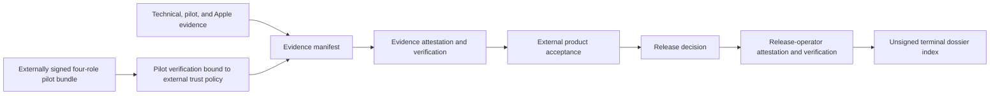

# Release candidate dossier

`ci/release_dossier.py` assembles the fixed-layout
`aura.release_candidate_dossier.v2` terminal bundle for the first production
profile. The dossier is an unsigned index. It is not a new
authorization authority: `ci/release_decision.py` remains the semantic
GO/NO-GO authority, and only its verified, role-separated Ed25519 operator
attestation authorizes a release.

The evidence graph is deliberately acyclic:



Neither the dossier tool nor the release-evidence workflow generates pilot
signoffs or product acceptance. Those are external decisions about the exact
candidate. Missing evidence stays `blocked`; supplied malformed, unsafe,
inconsistent, or stale evidence is `fail`.

## Fixed layout

An assembly input root contains only these paths (missing paths are permitted
for a preliminary `blocked` dossier):

```text
evidence/evidence-manifest.json
evidence/evidence-manifest.attestation.json
evidence/evidence-manifest.attestation-verification.json
apple/apple-release-verification.json
apple/apple-reproducibility.json
apple/release-manifest.json
pilot/pilot-gate-report.json
pilot/pilot-signoff-verification.json
product/product-integration-acceptance.json
```

`assemble` copies stable bounded snapshots of the available inputs, creates
`decision/release-decision.json`, and adds `dossier.json`. The preliminary
dossier is never authorization to ship, even when its embedded decision is
`go`.

`finalize` accepts only a complete preliminary dossier and adds exactly:

```text
decision/release-decision.attestation.json
decision/release-decision.attestation-verification.json
```

The final bundle therefore contains exactly thirteen regular, non-hard-linked
files. Extra paths, symlinks, FIFOs, device nodes, oversized files, duplicate
JSON keys, non-finite JSON, changed files, and output aliases are rejected.
Outputs are fresh, no-clobber publications beneath a pinned real parent
directory.

Public keys and the pilot trust policy are external trust roots. They are used
to re-verify the evidence signature, every embedded pilot attestation, and the
release-operator signature but are never copied into the dossier. The dossier
records the caller-pinned canonical pilot-policy digest plus the ordered signer
SPKI identities reported by the verified leaf. Evidence, pilot-reviewer, and
release-operator keys are role-separated by the semantic authority. Private
keys must never be placed in an input root or dossier.

## Assemble

The output parent must already exist and the output directory must not exist.
Without every required child, the command still writes a machine-readable
preliminary dossier whose authorization is `blocked`.

```bash
python3 ci/release_dossier.py assemble \
  --root artifacts/release-inputs \
  --candidate-revision '<40 lowercase release revision R>' \
  --runtime-version 0.2.0 \
  --evidence-public-key /trusted/evidence-signer-public.pem \
  --expected-evidence-key-id evidence-signer-2026-01 \
  --pilot-signoff-trust-policy /trusted/pilot-signoff-policy.json \
  --expected-pilot-signoff-trust-policy-sha256 '<64 lowercase canonical policy digest>' \
  --output artifacts/release-dossier-preliminary
```

For a complete candidate, sign the embedded decision with
`ci/release_decision.py sign`, supplying the exact evidence files from the
preliminary bundle. The signing command independently recomputes the decision;
it cannot sign `no-go`.

## Finalize and verify

```bash
python3 ci/release_dossier.py finalize \
  --root artifacts/release-dossier-preliminary \
  --release-attestation artifacts/release-decision.attestation.json \
  --evidence-public-key /trusted/evidence-signer-public.pem \
  --expected-evidence-key-id evidence-signer-2026-01 \
  --release-public-key /trusted/release-operator-public.pem \
  --expected-release-key-id release-operator-2026-01 \
  --pilot-signoff-trust-policy /trusted/pilot-signoff-policy.json \
  --expected-pilot-signoff-trust-policy-sha256 '<64 lowercase canonical policy digest>' \
  --output artifacts/release-dossier-final

python3 ci/release_dossier.py verify \
  --root artifacts/release-dossier-final \
  --evidence-public-key /trusted/evidence-signer-public.pem \
  --expected-evidence-key-id evidence-signer-2026-01 \
  --release-public-key /trusted/release-operator-public.pem \
  --expected-release-key-id release-operator-2026-01 \
  --pilot-signoff-trust-policy /trusted/pilot-signoff-policy.json \
  --expected-pilot-signoff-trust-policy-sha256 '<64 lowercase canonical policy digest>' \
  --output artifacts/release-dossier-verification.json \
  --require-pass
```

The verifier re-reads the exact fixed tree, recomputes the release decision
from the bundled source evidence, re-verifies the four pilot attestations
against the caller-supplied policy and digest, verifies both release signature
chains against caller-pinned keys and key identifiers, checks role separation,
and rebuilds the dossier index canonically. Copied verification reports are
never treated as authority.

## Hosted evidence collection

`.github/workflows/release-evidence-finalize.yml` is a manual, secretless
precondition workflow named `Release Evidence Freeze`, not a GO workflow. It
accepts exact Promotion Gate and Apple Artifact run IDs and attempts for one
exact `R`, rejects PR/fork/stale/failed/expired sources, downloads the exact
immutable artifact IDs, hard-checks their archive SHA-256 values, enforces fixed
ZIP inventories, re-verifies the carried pilot leaf against the externally
configured policy, and rebuilds the final unsigned evidence manifest with every
production child.

The preceding manual `Pilot Signoff Ingest` workflow accepts only a base64
signed bundle plus caller-declared raw SHA-256 and byte length (maximum 32 KiB)
for exact `R`. It writes no signatures and receives no private key. A valid
signed `pending` or `needs_changes` bundle may retain its exact three-file
diagnostic artifact, but its run is unsuccessful and therefore ineligible for
Promotion. Promotion pins a successful first-attempt ingest run, derives and
pins that run's sole artifact ID/digest/length from GitHub metadata, downloads
with a token used only for metadata and transport, and then verifies offline
before giving the exact projection to the Rust pilot gate. Freeze repeats that
offline verification and carries only
`pilot/pilot-signoff-verification.json` into the dossier source layout.
`Promotion Gate` is manual-only: tag pushes no longer trigger or authorize
promotion because they cannot supply the exact ingest source. For
`target=release`, the ingest run ID is mandatory and its attempt must be `1`.

Hosted execution is currently a governance prerequisite, not an enabled trust
anchor. Repository variables `AURA_PILOT_SIGNOFF_TRUST_POLICY_B64`,
`AURA_PILOT_SIGNOFF_TRUST_POLICY_SHA256`, and
`AURA_PILOT_SIGNOFF_WORKFLOW_ID` must be externally provisioned with reviewed
change control. Repository variables are mutable configuration, not
intrinsically protected trust storage. The variables and registered workflow
ID are currently absent, so hosted intake, release Promotion, and Freeze fail
closed. The policy digest is the helper's domain-separated canonical policy
identity, not the SHA-256 of arbitrary policy file bytes.

Only first attempts are eligible. If a hosted run must be rerun, start a new
run with a new immutable run ID; this avoids ambiguity between artifacts from
different attempts of the same run.

Its output must be signed later by an external evidence operator before product
acceptance and dossier assembly. The workflow contains no signing key and
cannot issue a release decision, synthesize the four human pilot signoffs, or
claim independent Apple reproduction, compiler trust, candidate-blindness, or
hermeticity.

The external signer must use a reviewed immutable signing implementation (or a
non-exportable HSM/KMS key), not execute arbitrary code from the candidate with
an exportable long-lived private key. The resulting
`evidence-manifest.attestation.json` and independently derived verification
report are placed beside the frozen manifest before product acceptance. See
`docs/evidence-manifest-attestation.md` for the exact sign/verify commands.

Hosted run IDs are collection-time controls, not dossier claims. The signed
release graph trusts the validated content identities (`H`/`A`/`R`, source-tree
and child SHA-256 values), not mutable, unsigned run metadata.
